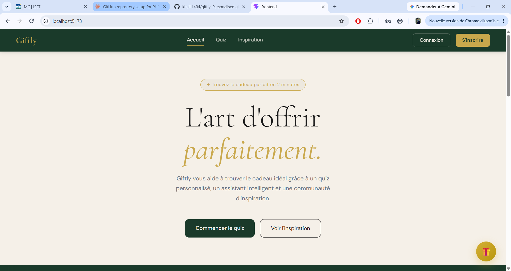
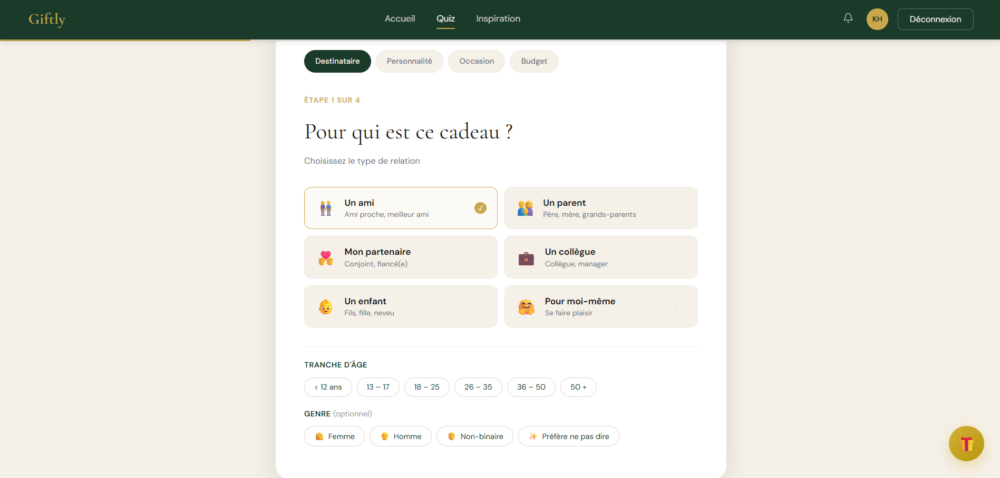
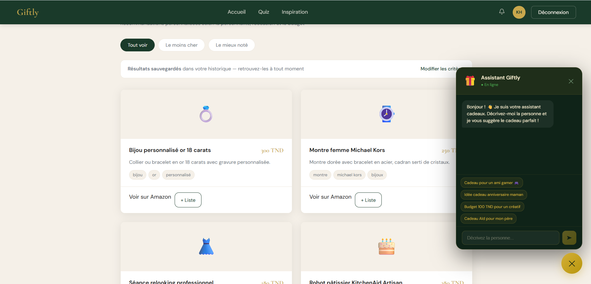

# Giftly

Personalised gift recommendation platform built with the MERN stack and a Python machine learning service.

Academic project, ISET Zaghouan, 2025-2026. Team of two.

## Features

- Registration and login with JWT authentication
- 4-step quiz (recipient, personality, occasion, budget) with gift recommendations
- ML recommendation engine: KNN and Random Forest (scikit-learn), about 85% cross-validation accuracy
- User dashboard: wishlists, history, recipients, budget tracker, reminders
- Community feed with likes and comments
- Admin routes

## Tech stack

| Part | Technologies |
|------|--------------|
| Frontend | React, Vite |
| Backend | Node.js, Express, MongoDB (Mongoose), JWT |
| ML service | Python, Flask, scikit-learn |

## Project structure

```
backend/    Express API (port 5000)
frontend/   React app (port 5173)
ml/         Flask ML service (port 5001)
```

## Installation

Requirements: Node.js, Python 3, MongoDB running locally.

1. Backend:
```
   cd backend
   npm install
   copy .env.example .env
   node server.js
```
2. ML service:
```
   cd ml
   pip install -r requirements.txt
   python app.py
```
3. Frontend:
```
   cd frontend
   npm install
   npm run dev
```
4. Open http://localhost:5173

## Screenshots






## Authors

Mohamed Khalil Nafeti and Hiba Cherif, supervised by Mme. Yossra Kassis.
